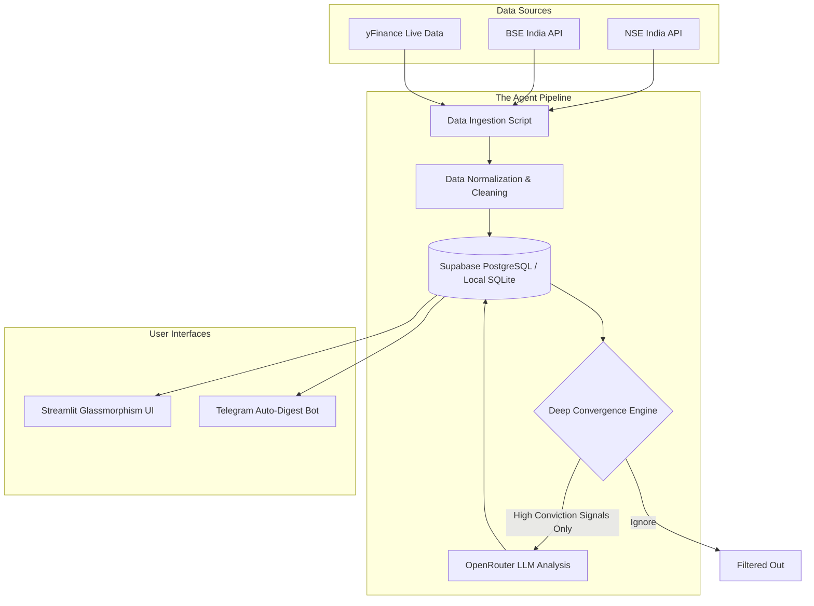
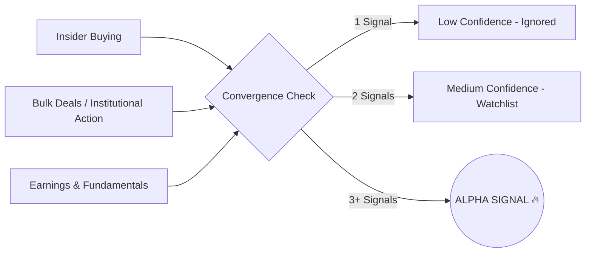

<div align="center">
  <h1>🎯 Opportunity Radar</h1>
  <p><b>An Autonomous AI Agent for Finding Deep Convergence "Alpha Signals" in the Indian Stock Market</b></p>
</div>

---

## 📖 What is Opportunity Radar?

Retail investors are drowning in market noise. Institutional data—like sudden insider buying, bulk deals, and hidden momentum—is scattered across disconnected sources. **Opportunity Radar** acts as an autonomous financial analyst. It actively ingests real-time NSE/BSE data, filters out the noise using a strict **Deep Convergence Engine**, and delivers high-conviction "Alpha Signals" directly to a dashboard and your Telegram app.

---

## 🏗️ System Architecture

The entire platform operates automatically. Below is the data flow from ingestion to user delivery:



---

## 🧠 The Deep Convergence Engine

Opportunity Radar doesn't just pump out random chart patterns. To be flagged as an **Alpha Signal**, a stock must undergo strict filtering where multiple institutional triggers align simultaneously.



---

## ✨ Key Features

- **🔍 Alpha Signal Finder:** Only shows stocks that pass the strict multi-signal convergence test.
- **🤖 AI Explains:** A conversational UI powered by OpenRouter (Llama 3 / Gemma 3 / Liquid) acting as your personal quantitative analyst.
- **📈 Signal Heatmap:** Instantly visualize the health of the market and the highest-scored opportunities.
- **📲 Telegram Automation:** Enter a Telegram Chat ID and the background cron-job will automatically send you your daily intelligence digest.
- **🛡️ Fallback Secure:** Uses Supabase PostgreSQL in production, but seamlessly falls back to local SQLite if a cloud database isn't available.

---

## 🛠️ Tech Stack

* **Backend & Pipeline:** Python 3.10+, Pandas, APScheduler
* **Frontend:** Streamlit 
* **Database:** Supabase (PostgreSQL) + SQLite (Fallback)
* **AI & NLP:** OpenRouter API 
* **Market Data:** yFinance, NSE & BSE Public APIs

---

## 🚀 Quickstart Guide

### 1. Install Dependencies
Ensure you have Python 3.10+ installed, then run:
```bash
pip install -r requirements.txt
```

### 2. Configure Environment Variables
Copy the `.env.example` file and rename it to `.env`. Fill in your specific API keys:
```bash
cp .env.example .env
```
*(Make sure to add your OpenRouter API Key and Telegram Bot Token)*

### 3. Run the Daily Pipeline
Before opening the UI, you need to populate the database with today's market data. The system will automatically use the local SQLite database if Supabase isn't configured.
```bash
python scripts/run_daily.py
```

### 4. Start the Application
Boot up the Streamlit frontend to interact with your agent:
```bash
python -m streamlit run app.py
```

---

## 🤝 Testing
To run the automated test suite for the signal generation rules and parsing:
```bash
pytest -q tests/
```
